# 
Water Tracker Application 

The application's backend is hosted on the free Cloudinary service, which may cause a delay when performing the first action that requires a response from the server side of the application.
## 
Overview

Stay Hydrated and Healthy with WaterTracker!

With WaterTracker, you can:

- Create Your Personal Account: Get started with a personalized experience.
- Calculate Your Optimal Daily Water Intake: Our smart calculator uses your gender, weight, phisical activity time to determine the perfect amount of water you need each day.
- Track Your Daily Water Consumption: Easily log every glass and stay on top of your hydration goals.
- Access Comprehensive Water Consumption Stats: Use our intuitive calendar to review your hydration history for any period.

Why Choose WaterTracker?

Using WaterTracker will not only help you stay hydrated but also boost your overall health and well-being. Join our community of health enthusiasts and start feeling better today!

Record Your Water Intake with Ease: Our user-friendly interface makes it simple to log your water consumption anytime, anywhere.

English and Deutsch interfaces are available.

    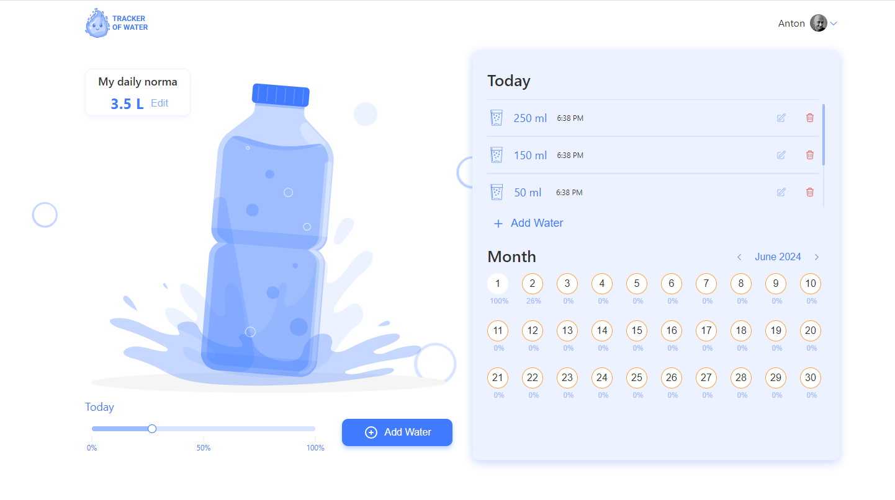

## Table of Contents

- [Components](#components)
  - [Header](#header)
  - [Pages](#pages)
  - [Main Components](#main-components)
- [Modals](#modals)
  - [UserLogoModal](#userlogomodal)
  - [SettingModal](#settingmodal)
  - [UserLogoutModal](#userlogoutmodal)
  - [DailyNormaModal](#dailynormamodal)
  - [TodayListModal](#todaylistmodal)

## Components

### Header

#### Non-Authorized User
- Logo: Displays the application logo and redirects to the WelcomePage for non-registered users.
- UserAuth: Button that redirects to the SigninPage.

    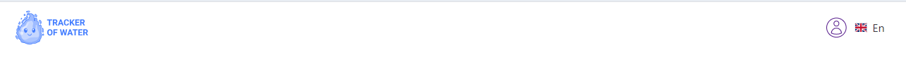

#### Authorized User
- Logo: Displays the application logo and redirects to the HomePage for registered users.
- UserLogo: Button to open the UserLogoModal, displaying user info and options to edit or log out.
- Lenguege swither: You can pick English or Deutsch interface.

    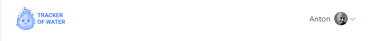

### Pages

#### WelcomePage
- Route: /welcome
- Displayed for non-authorized users.

    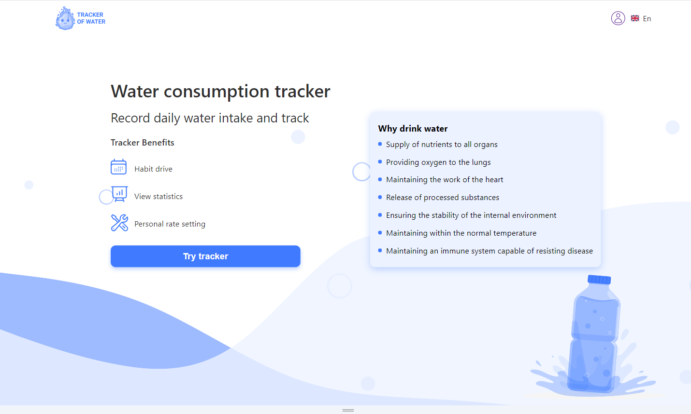

#### SignupPage
- Route: /signup
- Contains the AuthForm for user registration.
- Validates all form fields.
- Automatically logs in the user after successful registration and redirects to HomePage.

    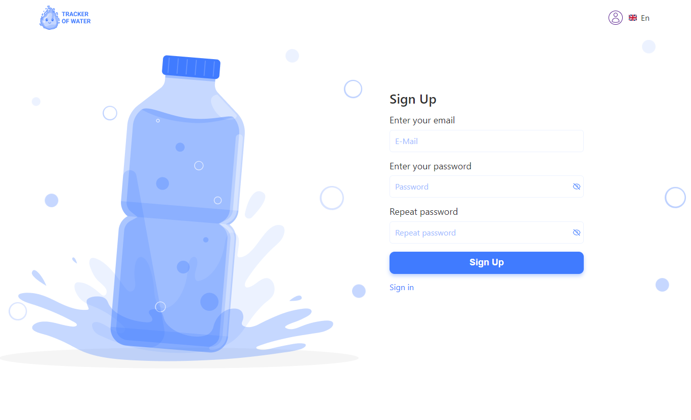

#### SigninPage
- Route: /signin
- Logs in the user and redirects to HomePage.
- Displays error notifications for failed login attempts.

    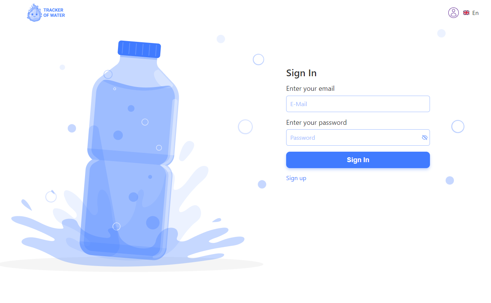

#### HomePage
Route: /home
Main page for authorized users with containers for: 
- DailyNorma: Displays user's daily water intake goal.
- WaterRatioPanel: Shows the ratio of consumed to planned water intake and opens a modal for logging water intake.
- TodayWaterList: Lists water portions consumed throughout the day.
- MonthStatsTable: Allows users to view water consumption statistics for any day of the month.

### Main Components
1. DailyNorma: Displays planned daily water intake.
2. WaterRatioPanel: Shows the ratio of consumed to planned water intake and opens a modal for logging water intake.
3. TodayWaterList: Displays a list of water portions consumed throughout the day.
4. MonthStatsTable: Allows users to view water consumption statistics for any day of the month.

    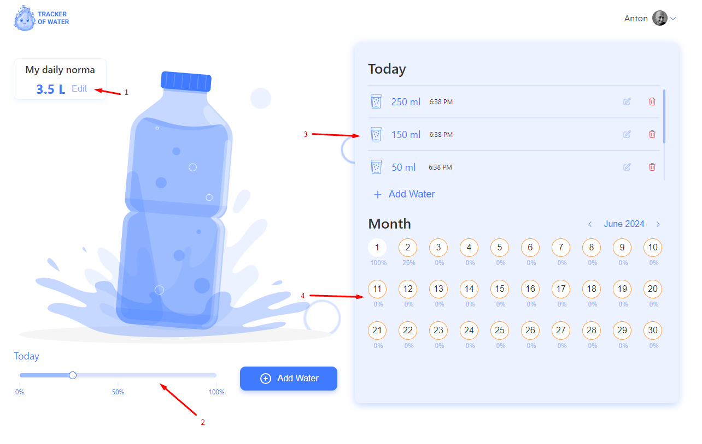

### Modals

#### UserLogoModal
Contains buttons:
- Setting: Opens the SettingModal.
- LogoutBtn: Opens the UserLogoutModal.

    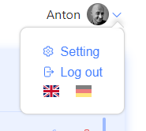

#### SettingModal
Renders a form with user information fields:
- Your photo: Upload a photo.
- Your gender identity: Radio buttons for gender selection.
- Your name: Input for name.
- E-mail: Input for email.
- Password: Inputs for changing the password.

    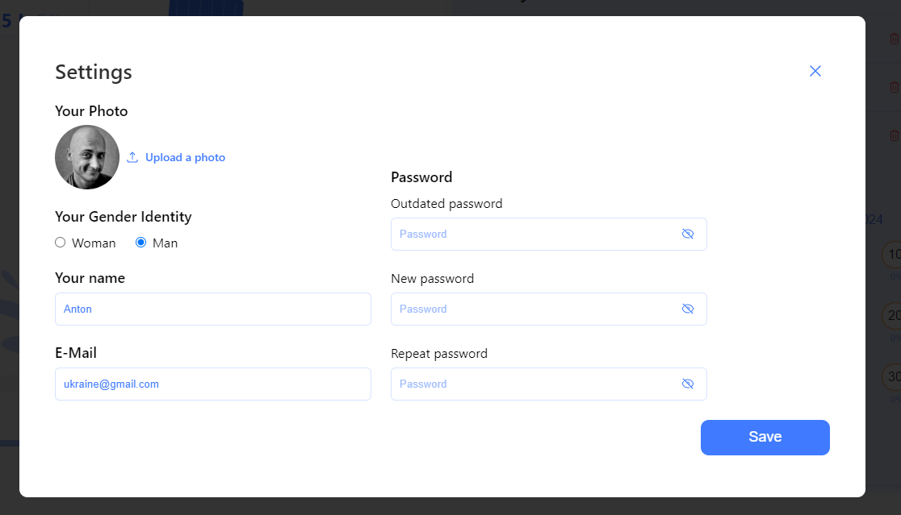

Modal closes on:
- Clicking the backdrop.
- Pressing Escape.
- Submitting the form after successful server response.

#### UserLogoutModal
Modal with:
- Header: "Log out"
- Subheader: "Do you really want to leave?"
- Buttons: "Cancel" and "Logout"

    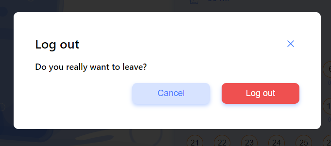

#### DailyNormaModal
Consists of:
- Header: "My daily norma"
- Description: Description of the water intake formula.
- Form: Form with fields for gender, weight, activity time, and calculated water intake.
- Save button: Button to submit data to the backend.

    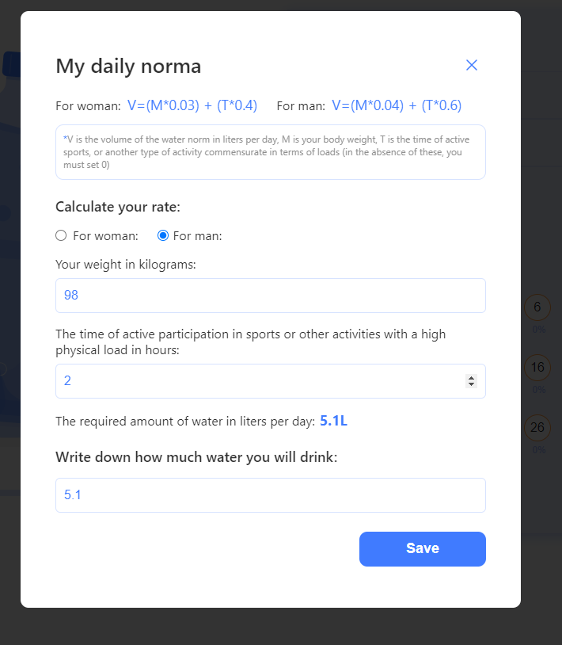

### TodayList
- Allows users to log or edit water intake amounts.

    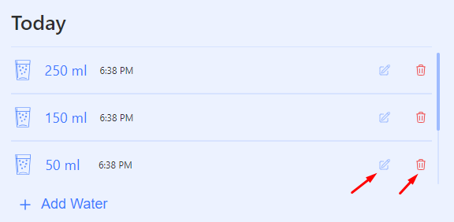

